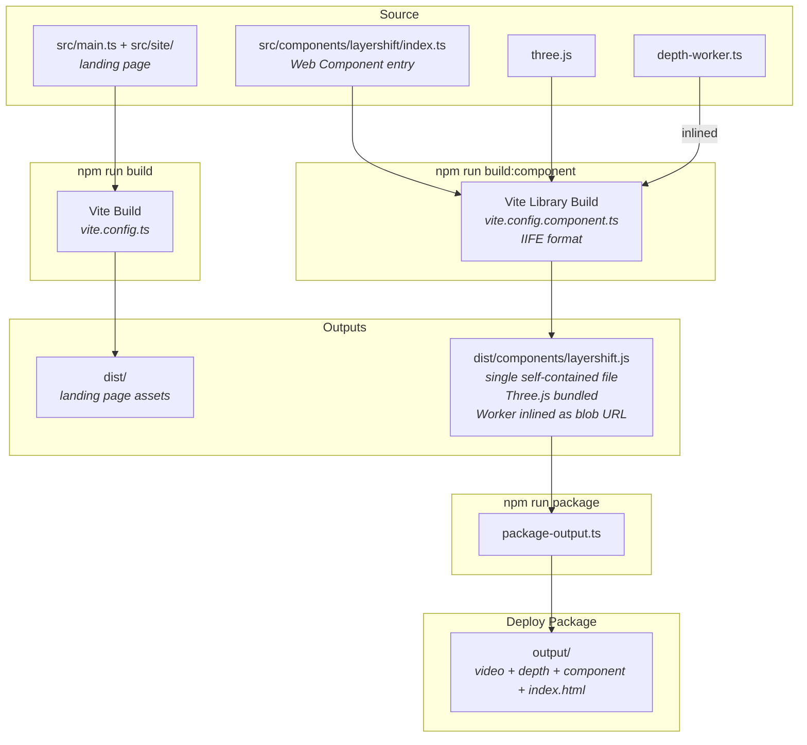

# Build System

Build targets, outputs, and packaging flow.

## Build Targets

```mermaid
flowchart TD
    subgraph "Source"
        SRC_SITE["src/main.ts + src/site/<br/><i>landing page</i>"]
        SRC_COMP["src/components/layershift/index.ts<br/><i>Web Component entry</i>"]
        THREEJS["three.js"]
        WORKER_SRC["depth-worker.ts"]
    end

    subgraph "npm run build"
        BUILD_SITE["Vite Build<br/><i>vite.config.ts</i>"]
    end

    subgraph "npm run build:component"
        BUILD_COMP["Vite Library Build<br/><i>vite.config.component.ts</i><br/><i>IIFE format</i>"]
    end

    subgraph "Outputs"
        DIST_SITE["dist/<br/><i>landing page assets</i>"]
        DIST_COMP["dist/components/layershift.js<br/><i>single self-contained file</i><br/><i>Three.js bundled</i><br/><i>Worker inlined as blob URL</i>"]
    end

    SRC_SITE --> BUILD_SITE --> DIST_SITE
    SRC_COMP --> BUILD_COMP --> DIST_COMP
    THREEJS --> BUILD_COMP
    WORKER_SRC -->|inlined| BUILD_COMP

    subgraph "npm run package"
        PACKAGE["package-output.ts"]
    end

    subgraph "Deploy Package"
        OUTPUT["output/<br/><i>video + depth + component + index.html</i>"]
    end

    DIST_COMP --> PACKAGE --> OUTPUT
```
