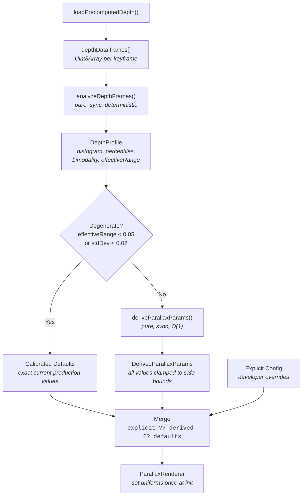
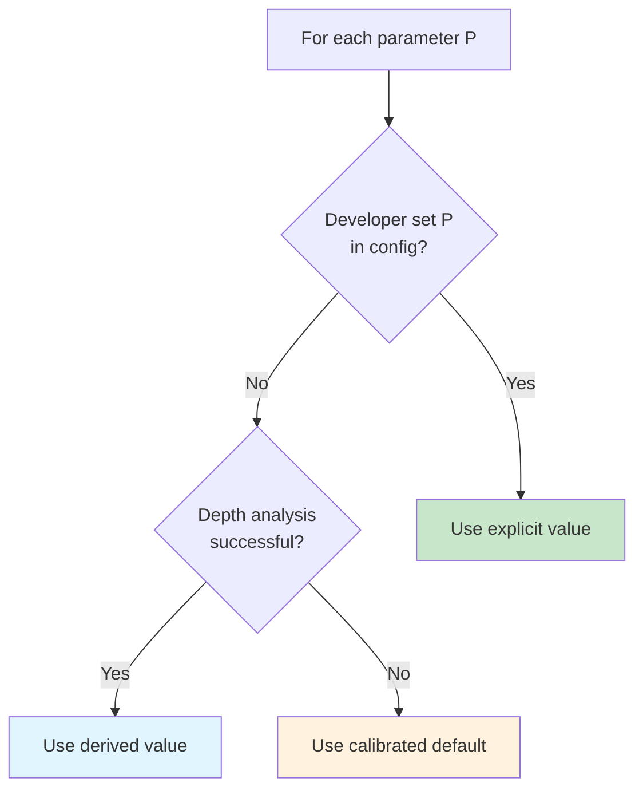

# Depth-Adaptive Parameter Derivation

Data flow and decision logic for the parallax parameter derivation system.

## Derivation Data Flow

```mermaid
flowchart TD
    LOAD["loadPrecomputedDepth()"]
    FRAMES["depthData.frames[]<br/><i>Uint8Array per keyframe</i>"]
    ANALYZE["analyzeDepthFrames()<br/><i>pure, sync, deterministic</i>"]
    PROFILE["DepthProfile<br/><i>histogram, percentiles,<br/>bimodality, effectiveRange</i>"]

    LOAD --> FRAMES --> ANALYZE --> PROFILE

    PROFILE --> REJECT{Degenerate?<br/>effectiveRange < 0.05<br/>or stdDev < 0.02}

    REJECT -->|Yes| DEFAULTS["Calibrated Defaults<br/><i>exact current production values</i>"]
    REJECT -->|No| DERIVE["deriveParallaxParams()<br/><i>pure, sync, O(1)</i>"]

    DERIVE --> DERIVED["DerivedParallaxParams<br/><i>all values clamped to safe bounds</i>"]

    DEFAULTS --> MERGE
    DERIVED --> MERGE

    EXPLICIT["Explicit Config<br/><i>developer overrides</i>"] --> MERGE

    MERGE["Merge<br/><code>explicit ?? derived ?? defaults</code>"]
    MERGE --> RENDERER["ParallaxRenderer<br/><i>set uniforms once at init</i>"]
```

## Parameter Resolution Precedence

```mermaid
flowchart TD
    START["For each parameter P"]
    Q1{Developer set P<br/>in config?}
    Q2{Depth analysis<br/>successful?}

    START --> Q1
    Q1 -->|Yes| USE_EXPLICIT["Use explicit value"]
    Q1 -->|No| Q2
    Q2 -->|Yes| USE_DERIVED["Use derived value"]
    Q2 -->|No| USE_DEFAULT["Use calibrated default"]

    style USE_EXPLICIT fill:#c8e6c9
    style USE_DERIVED fill:#e1f5fe
    style USE_DEFAULT fill:#fff3e0
```
