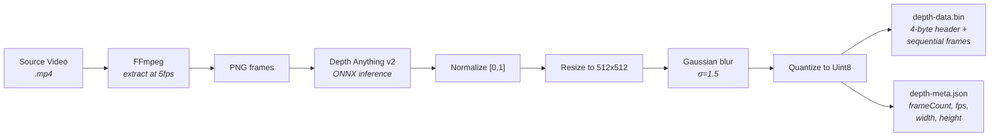
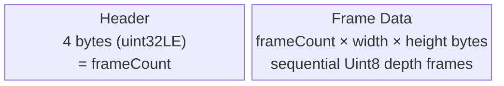
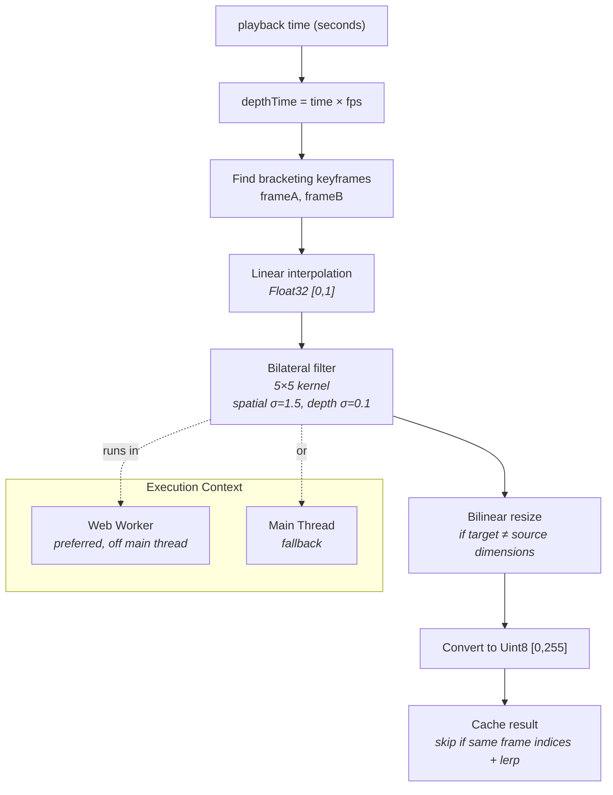

# Depth Precomputation Pipeline

Offline depth map generation and runtime interpolation.

## Offline Generation

```mermaid
flowchart LR
    VIDEO["Source Video<br/><i>.mp4</i>"]
    FFMPEG["FFmpeg<br/><i>extract at 5fps</i>"]
    FRAMES["PNG frames"]
    MODEL["Depth Anything v2<br/><i>ONNX inference</i>"]
    NORM["Normalize [0,1]"]
    RESIZE["Resize to 512x512"]
    BLUR["Gaussian blur<br/><i>σ=1.5</i>"]
    QUANT["Quantize to Uint8"]
    BIN["depth-data.bin<br/><i>4-byte header +<br/>sequential frames</i>"]
    META["depth-meta.json<br/><i>frameCount, fps,<br/>width, height</i>"]

    VIDEO --> FFMPEG --> FRAMES --> MODEL --> NORM --> RESIZE --> BLUR --> QUANT --> BIN
    QUANT --> META
```

## Binary Format

```mermaid
block-beta
    columns 2
    A["Header<br/>4 bytes (uint32LE)<br/>= frameCount"]:1
    B["Frame Data<br/>frameCount × width × height bytes<br/>sequential Uint8 depth frames"]:1
```

## Runtime Interpolation

```mermaid
flowchart TD
    TIME["playback time (seconds)"]
    IDX["depthTime = time × fps"]
    BRACKET["Find bracketing keyframes<br/>frameA, frameB"]
    LERP["Linear interpolation<br/><i>Float32 [0,1]</i>"]
    BILATERAL["Bilateral filter<br/><i>5×5 kernel</i><br/><i>spatial σ=1.5, depth σ=0.1</i>"]
    BILINEAR["Bilinear resize<br/><i>if target ≠ source dimensions</i>"]
    UINT8["Convert to Uint8 [0,255]"]
    CACHE["Cache result<br/><i>skip if same frame indices + lerp</i>"]

    TIME --> IDX --> BRACKET --> LERP --> BILATERAL --> BILINEAR --> UINT8 --> CACHE

    subgraph "Execution Context"
        WORKER["Web Worker<br/><i>preferred, off main thread</i>"]
        SYNC["Main Thread<br/><i>fallback</i>"]
    end

    BILATERAL -.->|runs in| WORKER
    BILATERAL -.->|or| SYNC
```
