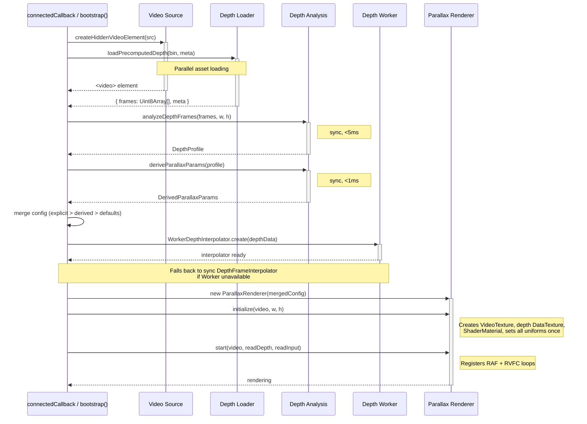

# Parallax Effect — Initialization Lifecycle

Initialization sequence for the `<layershift-parallax>` Web Component and the demo app.

```mermaid
sequenceDiagram
    participant App as connectedCallback / bootstrap()
    participant Video as Video Source
    participant Depth as Depth Loader
    participant Analysis as Depth Analysis
    participant Worker as Depth Worker
    participant Renderer as Parallax Renderer

    App->>+Video: createHiddenVideoElement(src)
    App->>+Depth: loadPrecomputedDepth(bin, meta)

    Note over Video,Depth: Parallel asset loading

    Video-->>-App: <video> element
    Depth-->>-App: { frames: Uint8Array[], meta }

    App->>+Analysis: analyzeDepthFrames(frames, w, h)
    Note right of Analysis: sync, <5ms
    Analysis-->>-App: DepthProfile

    App->>+Analysis: deriveParallaxParams(profile)
    Note right of Analysis: sync, <1ms
    Analysis-->>-App: DerivedParallaxParams

    App->>App: merge config (explicit > derived > defaults)

    App->>+Worker: WorkerDepthInterpolator.create(depthData)
    Worker-->>-App: interpolator ready

    Note over App,Worker: Falls back to sync DepthFrameInterpolator<br/>if Worker unavailable

    App->>+Renderer: new ParallaxRenderer(mergedConfig)
    App->>Renderer: initialize(video, w, h)
    Note right of Renderer: Creates VideoTexture, depth DataTexture,<br/>ShaderMaterial, sets all uniforms once
    App->>Renderer: start(video, readDepth, readInput)
    Note right of Renderer: Registers RAF + RVFC loops
    Renderer-->>-App: rendering
```
