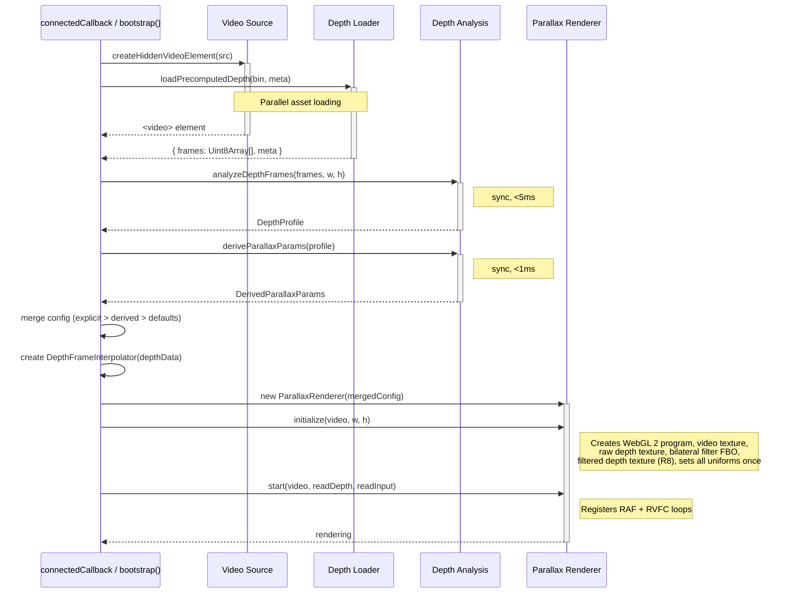

# Parallax Effect — Initialization Lifecycle

Initialization sequence for the `<layershift-parallax>` Web Component and the demo app.

```mermaid
sequenceDiagram
    participant App as connectedCallback / bootstrap()
    participant Video as Video Source
    participant Depth as Depth Loader
    participant Analysis as Depth Analysis
    participant Renderer as Parallax Renderer

    App->>+Video: createHiddenVideoElement(src)
    App->>+Depth: loadPrecomputedDepth(bin, meta)

    Note over Video,Depth: Parallel asset loading

    Video-->>-App: <video> element
    Depth-->>-App: { frames: Uint8Array[], meta }

    App->>+Analysis: analyzeDepthFrames(frames, w, h)
    Note right of Analysis: sync, <5ms
    Analysis-->>-App: DepthProfile

    App->>+Analysis: deriveParallaxParams(profile)
    Note right of Analysis: sync, <1ms
    Analysis-->>-App: DerivedParallaxParams

    App->>App: merge config (explicit > derived > defaults)

    App->>App: create DepthFrameInterpolator(depthData)

    App->>+Renderer: new ParallaxRenderer(mergedConfig)
    App->>Renderer: initialize(video, w, h)
    Note right of Renderer: Creates WebGL 2 program, video texture,<br/>raw depth texture, bilateral filter FBO,<br/>filtered depth texture (R8), sets all uniforms once
    App->>Renderer: start(video, readDepth, readInput)
    Note right of Renderer: Registers RAF + RVFC loops
    Renderer-->>-App: rendering
```
