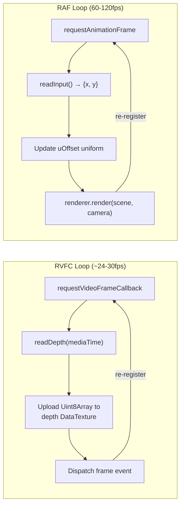
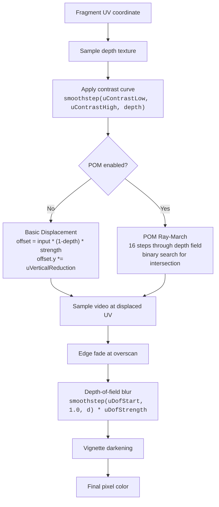

# Parallax Effect — Render Loop

Two decoupled loops run simultaneously during playback.

## Dual-Loop Architecture

```mermaid
graph LR
    subgraph "RVFC Loop (~24-30fps)"
        direction TB
        VFC["requestVideoFrameCallback"]
        RD["readDepth(mediaTime)"]
        UT["Upload Uint8Array to<br/>depth DataTexture"]
        EV["Dispatch frame event"]
        VFC --> RD --> UT --> EV
        EV -->|re-register| VFC
    end

    subgraph "RAF Loop (60-120fps)"
        direction TB
        RAF["requestAnimationFrame"]
        RI["readInput() → {x, y}"]
        UO["Update uOffset uniform"]
        RENDER["renderer.render(scene, camera)"]
        RAF --> RI --> UO --> RENDER
        RENDER -->|re-register| RAF
    end
```

## GPU Shader Pipeline

```mermaid
flowchart TD
    UV["Fragment UV coordinate"]
    SAMPLE_D["Sample depth texture"]
    CONTRAST["Apply contrast curve<br/><code>smoothstep(uContrastLow, uContrastHigh, depth)</code>"]

    UV --> SAMPLE_D --> CONTRAST

    CONTRAST --> POM_CHECK{POM enabled?}

    POM_CHECK -->|No| BASIC["Basic Displacement<br/>offset = input * (1-depth) * strength<br/>offset.y *= uVerticalReduction"]
    POM_CHECK -->|Yes| POM["POM Ray-March<br/>16 steps through depth field<br/>binary search for intersection"]

    BASIC --> DISPLACED["Sample video at displaced UV"]
    POM --> DISPLACED

    DISPLACED --> EDGE["Edge fade at overscan"]
    EDGE --> DOF["Depth-of-field blur<br/><code>smoothstep(uDofStart, 1.0, d) * uDofStrength</code>"]
    DOF --> VIG["Vignette darkening"]
    VIG --> OUT["Final pixel color"]
```
