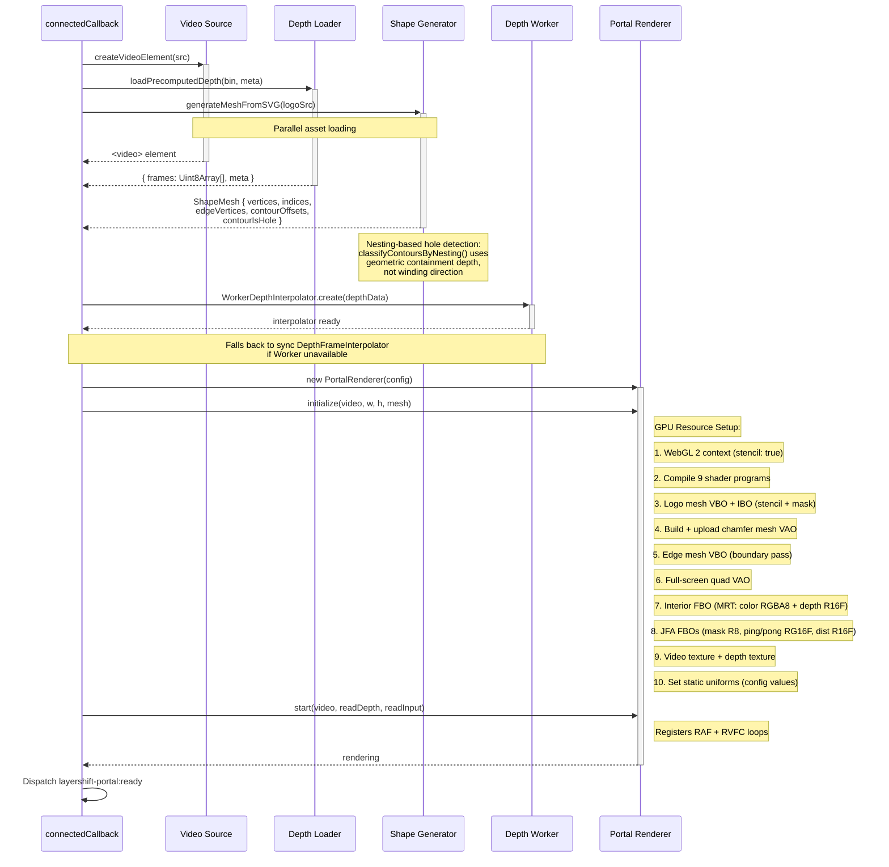

# Portal Effect — Initialization Lifecycle

Initialization sequence for the `<layershift-portal>` Web Component.

## Shader Programs (9 total)

| Program | Vertex | Fragment | Purpose |
|---------|--------|----------|---------|
| Stencil | STENCIL_VS | STENCIL_FS | Mark logo shape in stencil buffer |
| Mask | MASK_VS | MASK_FS | Render binary mask for JFA input |
| JFA Seed | JFA_SEED_VS | JFA_SEED_FS | Detect edges, write seed coordinates |
| JFA Flood | JFA_FLOOD_VS | JFA_FLOOD_FS | Jump flood iterations (ping-pong) |
| JFA Distance | JFA_DIST_VS | JFA_DIST_FS | Convert seed coords to scalar distance |
| Interior | INTERIOR_VS | INTERIOR_FS | POM + lens + DOF + fog + color grading → FBO |
| Composite | COMPOSITE_VS | COMPOSITE_FS | Emissive passthrough + edge occlusion |
| Chamfer | CHAMFER_VS | CHAMFER_FS | Geometric chamfer with Blinn-Phong + video blur |
| Boundary | BOUNDARY_VS | BOUNDARY_FS | Rim + refraction + chromatic + edge wall + occlusion |

## Geometry Buffers

| Buffer | Contents | Created |
|--------|----------|---------|
| Logo mesh VBO + IBO | Triangulated SVG (earcut), shared by stencil + mask | Once at init |
| Chamfer mesh VAO | Ring of quads around contours (6 floats/vert: x, y, nx, ny, nz, lerpT) | Once at init |
| Edge mesh VBO | Thick line quads along logo outline | Once at init |
| Full-screen quad VAO | 2-triangle quad for fullscreen passes | Once at init |

## FBO Allocation

| FBO | Attachments | Resolution | Purpose |
|-----|-------------|------------|---------|
| Interior FBO | Color (RGBA8) + Depth (R16F) | Canvas resolution | Off-screen interior scene |
| Mask FBO | Color (R8) | Half resolution | Binary mask for JFA |
| JFA Ping FBO | Color (RG16F) | Half resolution | Flood pass A |
| JFA Pong FBO | Color (RG16F) | Half resolution | Flood pass B |
| Distance FBO | Color (R16F) | Half resolution | Final distance field |
