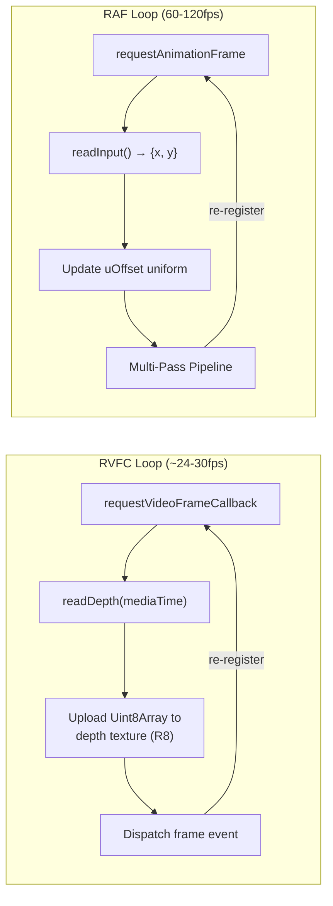
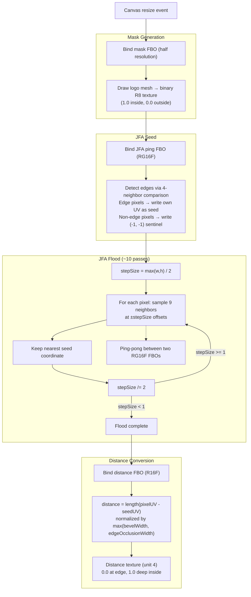

# Portal Effect — Render Pipeline

Multi-pass stencil + FBO render pipeline for the Logo Depth Portal effect.

## Dual-Loop Architecture

## Multi-Pass Pipeline

```mermaid
flowchart TD
    CLEAR["Clear color + stencil buffers"]

    subgraph "Pass 1: Interior Scene → FBO"
        I_SETUP["Bind interior FBO<br/>MRT: color (RGBA8) + depth (R16F)<br/>Clear FBO"]
        I_VIDEO["Upload video frame to texture (unit 0)<br/>Upload depth frame to texture (unit 1)"]
        I_RENDER["INTERIOR_FS shader:<br/>POM ray-march (16 steps)<br/>Lens-transformed depth<br/>DOF blur + fog + color grading"]
        I_OUT["FBO color texture (unit 2)<br/>FBO depth texture (unit 3)"]
        I_SETUP --> I_VIDEO --> I_RENDER --> I_OUT
    end

    subgraph "Pass 2a: Stencil Mark"
        S_SETUP["colorMask(false, false, false, false)<br/>stencilFunc(ALWAYS, 1, 0xFF)<br/>stencilOp(KEEP, KEEP, REPLACE)"]
        S_DRAW["Draw triangulated SVG mesh<br/>(vertices + indices from earcut)"]
        S_RESULT["Stencil buffer: 1 inside logo, 0 outside"]
        S_SETUP --> S_DRAW --> S_RESULT
    end

    subgraph "Pass 2b: Emissive Composite (stencil-tested)"
        C_SETUP["colorMask(true, true, true, true)<br/>stencilFunc(EQUAL, 1, 0xFF)<br/>stencilOp(KEEP, KEEP, KEEP)"]
        C_SAMPLE["Sample interior color (unit 2)<br/>Sample JFA distance field (unit 4)"]
        C_EMISSIVE["Emissive passthrough:<br/>sRGB → linear<br/>Edge occlusion ramp from distance field<br/>linear → sRGB"]
        C_OUT["Interior video at source brightness<br/>Subtle darkening near chamfer seam only"]
        C_SETUP --> C_SAMPLE --> C_EMISSIVE --> C_OUT
    end

    subgraph "Pass 2c: Chamfer Geometry (opaque)"
        CH_SETUP["Disable stencil test<br/>Disable blending"]
        CH_DRAW["Draw chamfer triangle ring<br/>(smooth normals, lerpT attribute)"]
        CH_SHADE["CHAMFER_FS shader:<br/>13-tap Poisson disc video blur<br/>Progressive blur (lerpT: 0→sharp, 1→blurred)<br/>Frosted glass tint through chamfer color<br/>Blinn-Phong (diffuse + specular)"]
        CH_OUT["Lit chamfer band around logo silhouette"]
        CH_SETUP --> CH_DRAW --> CH_SHADE --> CH_OUT
    end

    subgraph "Pass 3: Boundary Effects (alpha blended)"
        B_SETUP["Enable alpha blending<br/>blendFunc(SRC_ALPHA, ONE_MINUS_SRC_ALPHA)"]
        B_SAMPLE["Sample interior color (unit 2)<br/>Sample interior depth (unit 3)<br/>Sample JFA distance field (unit 4)"]
        B_EFFECTS["BOUNDARY_FS shader:<br/>Depth-reactive rim lighting<br/>Refraction + chromatic fringe<br/>Bevel shading (directional)<br/>Volumetric edge wall (specular)<br/>Occlusion darkening"]
        B_OUT["Dimensional edge treatment on logo boundary"]
        B_SETUP --> B_SAMPLE --> B_EFFECTS --> B_OUT
    end

    CLEAR --> I_SETUP
    I_OUT --> S_SETUP
    S_RESULT --> C_SETUP
    C_OUT --> CH_SETUP
    CH_OUT --> B_SETUP
```

## JFA Distance Field (Computed on Resize)

## Texture Unit Assignments

| Unit | Content | Updated |
|------|---------|---------|
| 0 | Video frame | Every RVFC callback |
| 1 | Depth map (R8) | Every RVFC callback |
| 2 | Interior FBO color (RGBA8) | Every RAF frame |
| 3 | Interior FBO depth (R16F) | Every RAF frame |
| 4 | JFA distance field (R16F) | On resize only |
