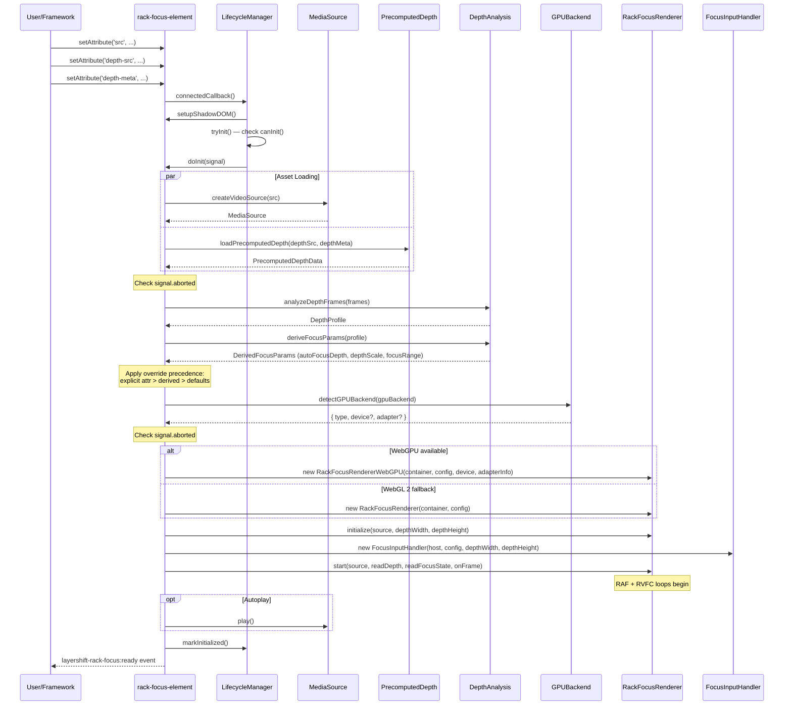

# Rack Focus — Initialization Sequence

Initialization flow for the `<layershift-rack-focus>` Web Component, from attribute setting through first rendered frame.

## Sequence Diagram

```mermaid
sequenceDiagram
    participant U as User/Framework
    participant EL as rack-focus-element
    participant LM as LifecycleManager
    participant MS as MediaSource
    participant PD as PrecomputedDepth
    participant DA as DepthAnalysis
    participant GB as GPUBackend
    participant RR as RackFocusRenderer
    participant FIH as FocusInputHandler

    U->>EL: setAttribute('src', ...)
    U->>EL: setAttribute('depth-src', ...)
    U->>EL: setAttribute('depth-meta', ...)

    EL->>LM: connectedCallback()
    LM->>EL: setupShadowDOM()
    LM->>LM: tryInit() — check canInit()

    LM->>EL: doInit(signal)

    par Asset Loading
        EL->>MS: createVideoSource(src)
        MS-->>EL: MediaSource
    and
        EL->>PD: loadPrecomputedDepth(depthSrc, depthMeta)
        PD-->>EL: PrecomputedDepthData
    end

    Note over EL: Check signal.aborted

    EL->>DA: analyzeDepthFrames(frames)
    DA-->>EL: DepthProfile

    EL->>DA: deriveFocusParams(profile)
    DA-->>EL: DerivedFocusParams (autoFocusDepth, depthScale, focusRange)

    Note over EL: Apply override precedence:<br/>explicit attr > derived > defaults

    EL->>GB: detectGPUBackend(gpuBackend)
    GB-->>EL: { type, device?, adapter? }

    Note over EL: Check signal.aborted

    alt WebGPU available
        EL->>RR: new RackFocusRendererWebGPU(container, config, device, adapterInfo)
    else WebGL 2 fallback
        EL->>RR: new RackFocusRenderer(container, config)
    end

    EL->>RR: initialize(source, depthWidth, depthHeight)

    EL->>FIH: new FocusInputHandler(host, config, depthWidth, depthHeight)

    EL->>RR: start(source, readDepth, readFocusState, onFrame)

    Note over RR: RAF + RVFC loops begin

    opt Autoplay
        EL->>MS: play()
    end

    EL->>LM: markInitialized()
    EL-->>U: layershift-rack-focus:ready event
```
