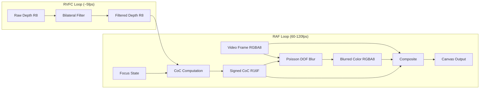
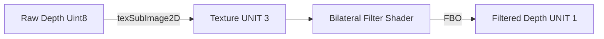
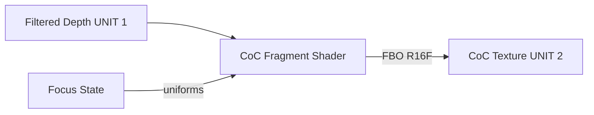
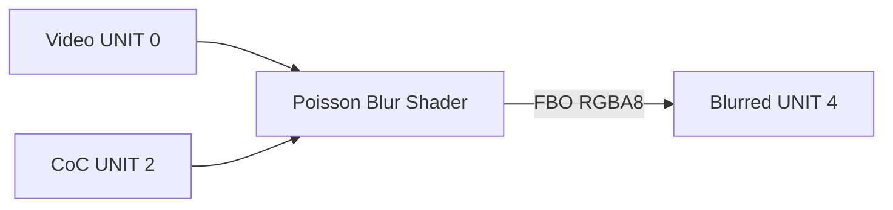
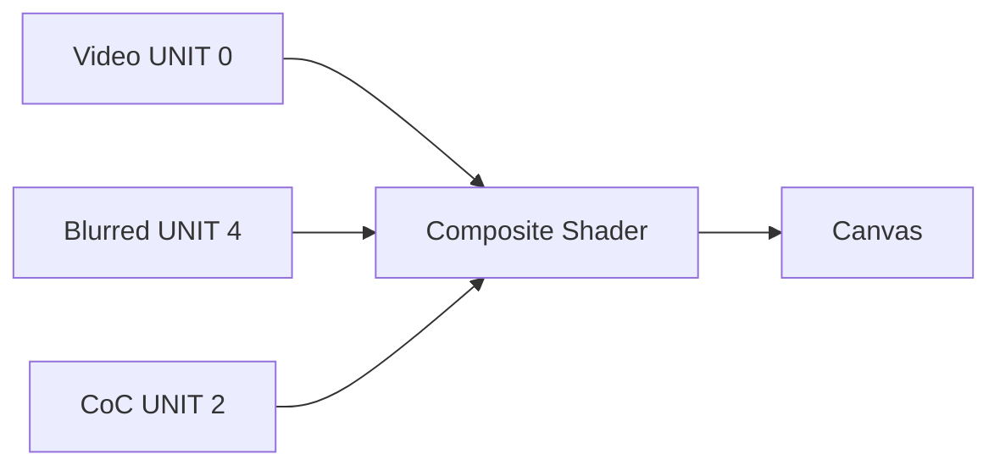
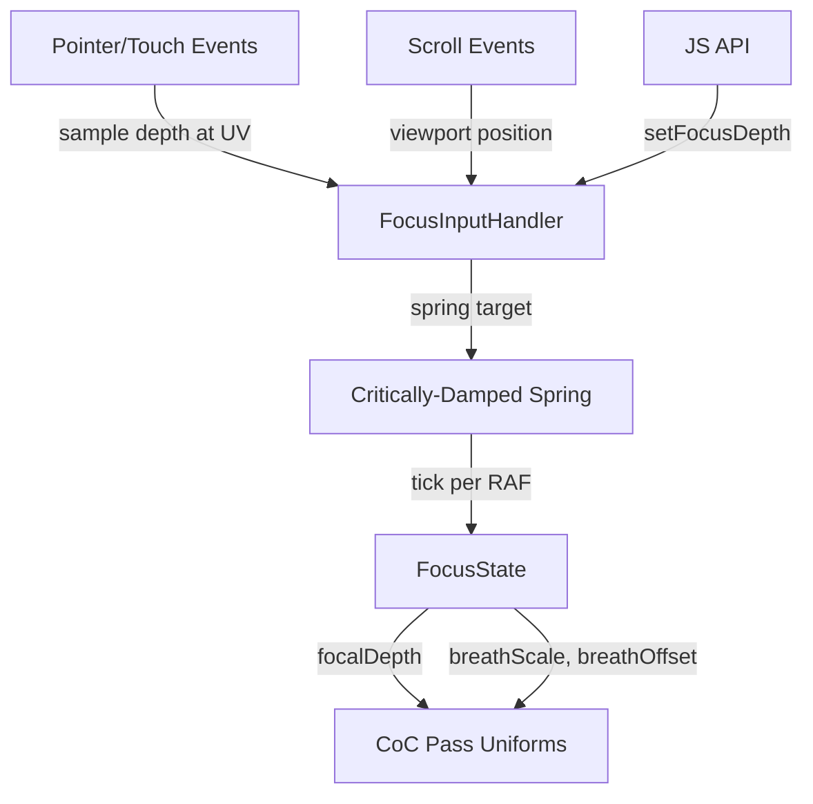

# Rack Focus — Render Pipeline

4-pass GPU pipeline for depth-aware bokeh blur. Two decoupled loops share the same architecture as parallax and portal effects.

## Pipeline Overview

## Pass Details

### Pass 1: Bilateral Filter (RVFC rate)

Edge-preserving depth smoothing. Reuses the same bilateral shader source from the parallax effect. Quality-tiered kernel radius: 5x5 (high/medium) or 3x3 (low).

### Pass 2: CoC Computation (RAF rate)

Computes signed Circle of Confusion per pixel:
- Reads focal depth, aperture, focus range, depth scale from uniforms (updated per-frame from spring)
- Applies focus breathing UV modification during transitions
- Outputs signed value: negative = foreground, positive = background, zero = in-focus

### Pass 3: Poisson DOF Blur (RAF rate)

Poisson disc bokeh blur with depth-aware weighting:
- Sample count: 48 (high) / 32 (medium) / 16 (low) via compile-time define
- Blur radius scaled by per-pixel CoC magnitude
- Background-on-foreground bleeding prevention (smoothstep + 0.25 suppression)
- Highlight bloom: luminance above threshold gets boosted weight
- **UV spaces**: Video sampled at cover-fit UVs (`vUv`), CoC FBO sampled at screen UVs (`vScreenUv`)

### Pass 4: Composite (RAF rate)

Final output:
- Smooth blend between sharp and blurred via `smoothstep(0.5, 2.0, |CoC|)`
- Static vignette darkening at frame edges
- **UV spaces**: Video sampled at cover-fit UVs (`vUv`), blurred FBO and CoC FBO sampled at screen UVs (`vScreenUv`)

## Focus Input Flow

## Texture Unit Map

| Unit | Name | Format | Purpose |
|------|------|--------|---------|
| 0 | video | RGBA8 | Current video/image frame |
| 1 | filteredDepth | R8 | Bilateral-filtered depth map |
| 2 | coc | R16F | Signed Circle of Confusion |
| 3 | rawDepth | R8 | Raw depth (bilateral input) |
| 4 | blurred | RGBA8 | DOF-blurred color result |
