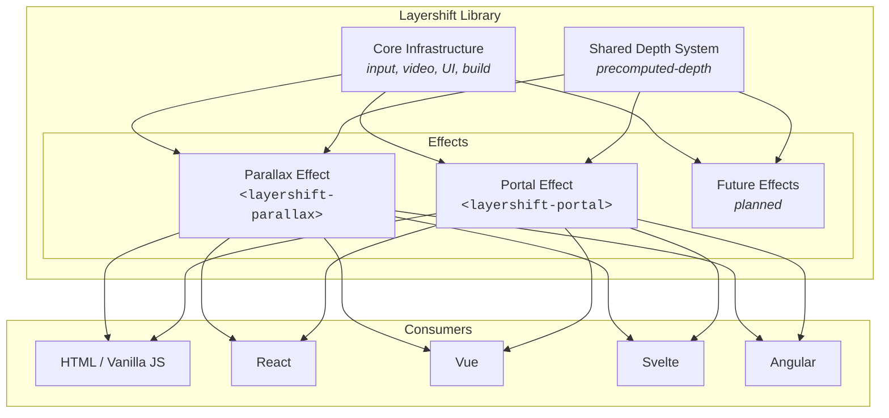
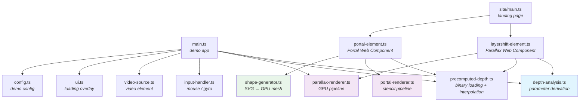

# System Architecture

High-level architecture of the Layershift video effects library.

## Library Structure

```mermaid
graph TD
    subgraph "Layershift Library"
        direction TB
        CORE["Core Infrastructure<br/><i>input, video, UI, build</i>"]
        DEPTH["Shared Depth System<br/><i>precomputed-depth</i>"]

        subgraph "Effects"
            PARALLAX["Parallax Effect<br/><code>&lt;layershift-parallax&gt;</code>"]
            PORTAL["Portal Effect<br/><code>&lt;layershift-portal&gt;</code>"]
            FUTURE["Future Effects<br/><i>planned</i>"]
        end
    end

    CORE --> PARALLAX
    CORE --> PORTAL
    CORE --> FUTURE
    DEPTH --> PARALLAX
    DEPTH --> PORTAL
    DEPTH --> FUTURE

    subgraph "Consumers"
        HTML["HTML / Vanilla JS"]
        REACT["React"]
        VUE["Vue"]
        SVELTE["Svelte"]
        ANGULAR["Angular"]
    end

    PARALLAX --> HTML
    PARALLAX --> REACT
    PARALLAX --> VUE
    PARALLAX --> SVELTE
    PARALLAX --> ANGULAR

    PORTAL --> HTML
    PORTAL --> REACT
    PORTAL --> VUE
    PORTAL --> SVELTE
    PORTAL --> ANGULAR
```

## Module Dependency Graph

```mermaid
graph TD
    MAIN["main.ts<br/><i>demo app</i>"]
    SITE["site/main.ts<br/><i>landing page</i>"]
    ELEMENT["layershift-element.ts<br/><i>Parallax Web Component</i>"]
    PORTAL_EL["portal-element.ts<br/><i>Portal Web Component</i>"]

    DA["depth-analysis.ts<br/><i>parameter derivation</i>"]
    PD["precomputed-depth.ts<br/><i>binary loading + interpolation</i>"]
    PR["parallax-renderer.ts<br/><i>GPU pipeline</i>"]
    PTR["portal-renderer.ts<br/><i>stencil pipeline</i>"]
    SG["shape-generator.ts<br/><i>SVG → GPU mesh</i>"]
    IH["input-handler.ts<br/><i>mouse / gyro</i>"]
    VS["video-source.ts<br/><i>video element</i>"]
    UI["ui.ts<br/><i>loading overlay</i>"]
    CFG["config.ts<br/><i>demo config</i>"]

    MAIN --> DA
    MAIN --> PD
    MAIN --> PR
    MAIN --> IH
    MAIN --> VS
    MAIN --> UI
    MAIN --> CFG

    ELEMENT --> DA
    ELEMENT --> PD
    ELEMENT --> PR

    PORTAL_EL --> PD
    PORTAL_EL --> PTR
    PORTAL_EL --> SG

    SITE --> ELEMENT
    SITE --> PORTAL_EL

    style DA fill:#e1f5fe
    style PR fill:#f3e5f5
    style PTR fill:#f3e5f5
    style SG fill:#e8f5e9
```
